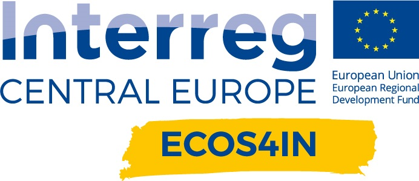

<p align="center">
  <a href="https://github.com/Quellichenonsannofareuncazzo/Sherlock.git" alt="Sherlock Repository">
    
  </a>
  <h1 align="center">Hackability@Sherlock</h1>
</p>

<p align="center">
  
  
</p>

<table align="center" style="background-color:rgba(0,0,0,0);">
  <tr style="background-color:rgba(0,0,0,0);">
    <td>A project by:</th>
    <td>In partnership with:</th>
  </tr>
  <tr style="background-color:rgba(0,0,0,0);">
    <td><a href="http://www.hackability.it/" alt="Hackability Website" target="_blank">
  		
  	  </a></th>
    <td><a href="https://www.fondazionebrodolini.it/" alt="FGB Website" target="_blank">
		
	  </a>
	  <a href="https://www.subvedenti.it/" alt="ANS Website" target="_blank">
		
	  </a>
	  <a href="https://www.interreg-central.eu/Content.Node/ECOS4IN.html" alt="ECOS4IN Website" target="_blank">
		
	  </a></th>
</table>


# Table of Contents

### [1. Introduction](#introduction)
### [2. Necessary Materials](#necessary-materials)
### [3. Setup & Installation](#setup--installation)
### [4. Usage](#usage)
### [5. Gallery](#gallery)
### [6. To Do List](#to-do-list)
### [7. Contacts & Acknowledgements](#contacts--acknowledgements)
### [8. License](#license)


# Introduction

This is the official repository for the **Hackability@Sherlock** project. 

The goal is to develop a **3D printed design object** which easily lets **visually impaired people** (but also normally sighted people) get a quick and informative **audio description of a small indoor space** - such as an hotel room, to help them navigate a new, unfamiliar environment and to get an understanding and overview of which object are in the space and where they are located.

Sherlock is composed of the following main components:
* A **RaspberryPi** to easily manage and control everything, from circuitry to audio management.
* A **circuit board** that manages all the smaller electronic components required to make Sherlock work.
* An **audio speaker** to reproduce the audio descriptions.
* A **3D printed casing**, with buttons, etched Braille text, the speaker's case and a lamp.

Sherlock's build is simple and straightforward, given some basic understanding of electronic circuitry, a bit of manual dexterity and experience in electronic DIY projects. Sherlock is very versatile, and once your prototype is ready, it is as simple as connecting a USB drive with the tracks to be played and Sherlock will be ready to reproduce them.

Sherlock's vision is to build a user-friendly and well-designed automatic concierge, that seamlessly integrates within any indoor environment and makes any person feel welcome and at home in unfamiliar space.


## Necessary Materials

For the list of necessary materials and hardware building instructions, check out: [`HARDWARE.md`](HARDWARE.md).


## Setup & Installation

Once the electronic components (and optionally, the 3D case) are ready, you need to setup the RaspberryPi board. 

**Note**: we assume you already loaded an appropriate Unix-based OS on your RaspberryPi. Otherwise, you can check the [official tutorial](https://www.raspberrypi.com/software/) out (you will need a PC with a microSD card reader).

You need to follow the following steps:


### 1. Connect to your RaspberryPi (either via `ssh` or directly to the device) and open a terminal window.


### 2. Clone the code repository into your preferred location:

```
cd </path/to/your/folder>
git clone https://github.com/HackabilityBIHC/Sherlock.git
cd Sherlock
```


### 3. **[Optional]** Create a virtual environment to isolate project's dependencies:

```
# Create and activate Python virtual environment
python3 -m venv sherlock-env
source sherlock-env/bin/activate
```


### 4. Install project dependencies:

```
pip3 install -r requirements.txt
```


## Usage


### 1. Make sure [`config/sherlock_parameters.yaml`](./config/sherlock_parameters.yaml) is correctly configured. 

More details on individual settings can be found in the `Sherlock` class [docstring](./src/sherlock.py#L60-L96).


### 2. Insert the USB drive in the RaspberryPi board.

Sherlock automatically detects and loads tracks to be played from inserted devices (e.g., USB drives). You just need to plug your own removable device in in the RaspberryPi I/O peripheral slots.

**Warning**: currently supported media file format is **`mp3`** only.

**Note**: if you want Sherlock to play your tracks in a certain order, rename them in the preferred order (e.g., `1_<trackname>.mp3`, `2_<trackname>.mp3`, `3_<trackname>.mp3`, etc.). By default, Sherlock will sort and reproduce the detected tracks in **alphabetical** order.

**Note**: in the [`config/sherlock_parameters.yaml`](./config/sherlock_parameters.yaml) file, in the `TRACKS_DIR` option, please make sure you leave the `"/media/"` part and replace `"sherlock"` with your own username (selected when installing the OS).


### 3. Configure the RaspberryPi to run Sherlock anytime it is turned on.

Open a terminal and run the following commands:

```
echo "cd </path/to/Sherlock/folder>/Sherlock" >> /etc/.bashrc
echo "source sherlock-env/bin/activate" >> /etc/.bashrc # If you made the virtual environment, else skip
echo "python3 src/main.py" >> /etc/.bashrc
```

Now Sherlock will start everytime the RaspberryPi is turned on.

**Note**: there is no other way to restart Sherlock but by turning off/on the RaspberryPi. If you want to restart the tracks, you can simply press the forward or backward buttons until you reach the desired track.


### 3a. Run Sherlock interactively.

You can also run Sherlock yourself from the command line by connecting to the RaspberryPi and running:

```
cd </path/to/Sherlock/folder>/Sherlock
source sherlock-env/bin/activate # if you created the virtual environment, else skip
python3 src/main.py
```

## Gallery


## To-do List

Below, a non-comprehensive list of stuff we should do in the future:
* **[MEDIUM]** Update `README.md` with the exact RaspberryPi model used for prototyping and testing (including Ubuntu distro, Python version, etc.) for reproducibility purposes.
* **[LOW]** Create a file with detailed technical specifications of the electronic components (resistors, LEDs, etc.). [here](./HARDWARE.md)
* **[MEDIUM]** Clean and update `requirements.txt` and check all dependencies (eventually try to see if we can work with the latest releases to get better long-term support).
* **[VERY LOW]** Add shields for release, license, etc.
* **[HIGH]** Implement fast-backward.
* **[HIGH]** Test fast-for/backward functions when end/start of track is reached.

Use GH Issues to open MRs/PRs for new improvements and adding functionalities.

Task priorities are in brackets.


## Contacts & Acknowledgements

The Sherlock project was realized by [Hackability@Milano](http://www.hackability.it/hackabilitymilano/), in partnership with [Fondazione G. Brodolini](https://www.fondazionebrodolini.it/) and [Associazione Nazionale Subvedenti](https://www.subvedenti.it/), whose contributions were essential for the brainstorming and development of Sherlock. 

Therefore, we would like to thank both the associations and the involved people: **Debora**, **Rosa**, **Monica**, and **Marco**. Also, many thanks to **Francesco De Rosa**, **Roberto Frisina**, and **Federico Zucca** for partipating and giving your feedbacks during the Workshop. 

The project was initially ideated in the context of the [EU's ECOS4IN project](https://www.interreg-central.eu/Content.Node/ECOS4IN.html), whose aim is to 
> promote sustainable and close cooperation among innovation actors and stakeholders, in order to improve and better equip European regions to face changes brought by the advent of the Industry 4.0. The goal of the project is to build a tool called **ECOS4IN Knowledge Base**, which will be tested in pilots as an essential source of information to raise awareness about Industry 4.0.

Sherlock is a byproduct of the **ECOS4IN Workshop** organized by Fondazione G. Brodolini with makers from Hackability@Milano, and inclusion stakeholders from Associazione Nazionale Subvedenti. 

If you have any questions, want to contribute, or want more information, feel free to reach out to us.
* **Hackability@Milano**, [milano@hackability.it](mailto:milano@hackability.it)
* Teo Bistoni, [@TeoBistoni](https://github.com/TeoBistoni)
* Dario Comini, [@mrDaerio](https://github.com/mrDaerio)
* Tam Huynh, [@mtdhuynh](https://github.com/mtdhuynh)
* Rossella Indaco, [@rossinda](https://github.com/rossinda)
* Francesco Rodighiero
* Luca Bocedi


## License

The Sherlock project is licensed under the [Creative Commons Attribution-NonCommercial-ShareAlike 4.0 International License][cc-by-nc-sa], as found in the [LICENSE.md](LICENSE.md) file.

[![CC BY-NC-SA 4.0][cc-by-nc-sa-image]][cc-by-nc-sa]

[cc-by-nc-sa]: http://creativecommons.org/licenses/by-nc-sa/4.0/
[cc-by-nc-sa-image]: https://licensebuttons.net/l/by-nc-sa/4.0/88x31.png
